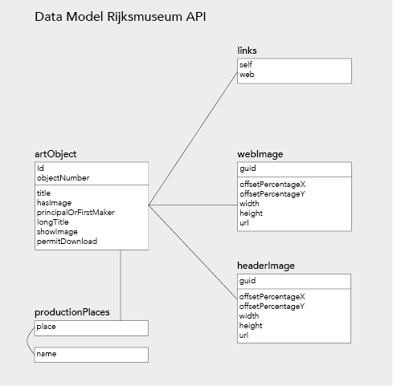
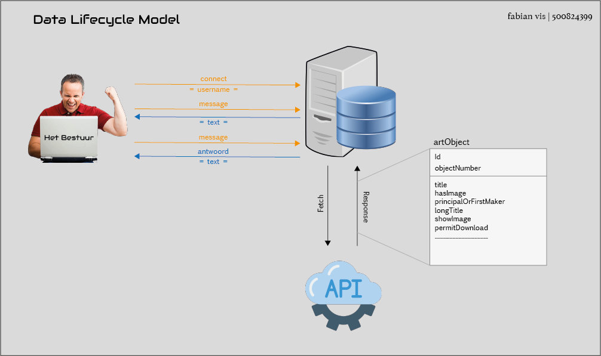

# Ra-Ra-Raad

## Beschrijving

> Een spel waarbij meerdere mensen de artiest van een random schilderij uit de collectie van het rijksmuseum moeten raden.

Bekijk de applicatie [hier](https://real-time-web.herokuapp.com/)

## Wat doet de Applicatie

Applicatie features:

- Werkt Real-Time (meerdere mensen kunnen meedoen)
- De gebruiker krijgt feedback wanneer de juiste artiest geraden is
- Er wordt gevraagd om een gebruikersnaam en deze wordt getoont in de chat
- Je kan zien hoeveel mensen er in de room aanwezig zijn

API Features:

- Fetchen & het weergeven van een schilderij
- Fetchen & gebruiken van de artiest
- Kijken of het goede antwoord geraden is doormiddel van de artiest

## API

Ik heb gebruik gemaakt van de Rijksmuseum API. Deze API is gratis te gebruiken en bevat alle schilderijen die zich in het rijksmuseum bevinden. Hier vind je alle informatie over de API: [Rijksmuseum - RijksData API](https://github.com/cmda-minor-web/web-app-from-scratch-2122/blob/main/course/rijksmuseum.md)

## API Response

Nadat er je connectie gemaakt heb met de api kan je verschillende informatie ophalen:

```
"artObjects": [
  {
    "links": {}               // links naar het schilderij in the api of website
    "id":                     // ID van het schilderij
    "objectNumber":           // object number van het schilderij
    "title":                  // schilderij titel
    "longTitle":              // schilderij lange titel
    "principleOrFirstMaker":  // schilderij artiest
    "hasImage":               // kijkt of het schilderij een image heeft
    "showImage":              // vertelt of het schilderij getoond word
    "permitDownload":         // vertelt of het schilderij gedownload mag worden
    "webImage": {}            // de web image
    "headerImage": {}         // de header image
    "productionPlaces": []    // plek waar het schilderij gemaakt is
  }
]
```

_Voor extra informatie kun je kijken op [de Rijksmuseum website](https://data.rijksmuseum.nl/object-metadata/api/)_

## Wat heb ik gedaan met de API

- **title** - Om de titel weertegeven
- **principleOrFirstMaker** - Om te kijken of het goede antwoord gegeven is
- **webImage** - Om het schilderij te tonen

## endpoint & parameters

Dit is het endpoint wat ik gebruik om connectie maken met de API

```
https://www.rijksmuseum.nl/api/nl/collection
```

Hier voeg ik de volgende parameters aan toe

```
?key=${API_KEY} // om mijn api key toe te voegen uit mijn .env bestand
&imgonly=true // om alleen de schilderij op te halen die een image hebben
```

De volgende endpoints gebruik ik om data uit de API te halen

```
principleOrInvolvedMaker   // de schilderij artiest
title                      // de schilderij titel
webImage.url               // de schilderij image
```

## API key aanvragen

Voordat je de API kunt gebruiken moet je eerst je eigen API key aanvragen bij het [Rijksmuseum](https://www.rijksmuseum.nl/en/rijksstudio). Daarna moet je ook nog een .env bestand aanmaken en de key hierin zetten.

## Data Model API



## Data Lifecycle Diagram



## Real-Time Events

### connect

Wanneer de gebruiker op de pagina komt krijgt hij een prompt waar hij zijn naam moet invullen. Die ingevulde naam wordt ge-emit met "register username"

### connection

Nadat de gebruiker een username heeft ingevuld word de pagina geladen. De events showData en usercnt worden "getriggerd"

### showData

Hier word clientside de data van de API ingeladen.

### message

Wanneer de gebruiker een berichtje stuurt word dit event "getriggerd". chat message wordt uitgevoerd en de username en de message worden meegestuurd. Verder wordt er ook een check gedaan of er in de message het correcte antwoord zit. Als het juiste antwoord geraden is word er een message en een username naar de client side gestuurd.

### disconnect

Wanneer een gebruiker weggaat wordt het disconnect event getriggerd. Bij de usercount word er eentje afgehaald en de nieuwe usercnt word client side naar de gebruikers gestuurd.

## To-Do

- [x] Chat functie
- [x] Real-time implementatie
- [x] Correcte antwoord
- [ ] Volgende schilderij
- [ ] Punten systeem

## Reflectie

Ik heb echt enorm veel geleerd van deze drie weken. Ik heb nog nooit iets met real-time gedaan dus het was een goeie uitdaging voor me. Sockets waren compleet nieuw voor me maar ik vond het heel gaaf dat ik uiteindelijk een werkende chat functie heb kunnen maken. Als ik nog extra tijd had had ik graag nog meer geleerd en de applicatie nog meer kunnen uitbreiden. Misschien ga ik dit in de vakantie doen omdat ik dit oprecht wel interessant vond. Een paar pijn punten waren wel dat in het begin sockets leren aardig lastig was maar zodra ik het begreep ging het wel stukke beter. Al met al veel geleerd en een ervaring rijker.

## Used packages

### Ejs

Ejs is a templating package which lets you mix javascript and html in the same file. I find this really helpful and it makes the whole project a little more easy to read. 

```
npm install ejs
```
```
app.set('view engine', 'ejs');
```

https://www.npmjs.com/package/ejs

### Express

Express is a framework package and it helps you with the routing in your application. You can use it like this for example to load up your home page:
```
app.get('/', (req, res) => {
  res.send('hello world')
})
```
```
npm install express
```
```
const express = require('express')
```

https://expressjs.com/en/starter/installing.html

### Node-fetch

Node-fetch is a must have package which lets you use fetch requests on the server side. Not really much to say here :P

```
npm install node-fetch
```
```
const fetch = require('node-fetch')
```

https://www.npmjs.com/package//node-fetch

### Socket.io

Socket.IO is a library that enables low-latency, bidirectional and event-based communication between a client and a server. Simply said its helps you make a lasting connection to other people in your application. I need this in my app so the 2 players see the same pokemon and guess on it too.

```
npm install socket.io
```
```
const io = require('socket.io')(http)
```
```
let socket = io()
```

https://www.npmjs.com/package/socket.io

### Nodemon

Nodemon is a really helpful package which lets you make changes to your node based application without you having to restart it all the time. Nodemon does that itself so you can just focus on your work.
```
npm install -g nodemon
```
https://www.npmjs.com/package/nodemon

### request

Request is designed to be the simplest way possible to make http calls. It supports HTTPS and follows redirects by default.

```
npm install request
```
https://www.npmjs.com/package/request
